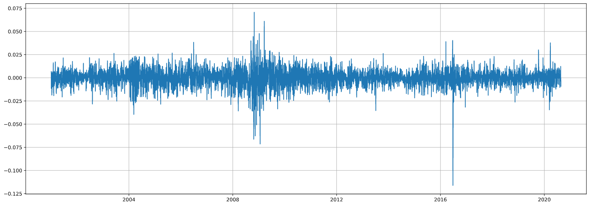
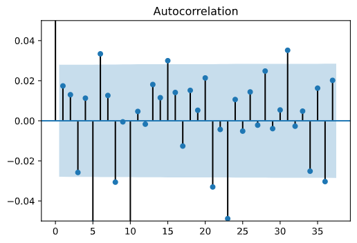
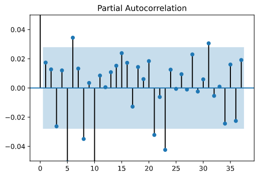

# LLM-based Exchange Rate Forecasting
How can LLM or generative AI be used for exchange rate forecasting based on historical GDP, inflation, exchange rates, and other socioeconomic factors

## Datasets
In finance, an exchange rate is a measure between two currencies. At this rate, one currency is exchanged for another. It is also regarded as the value of one country’s currency in terms of another currency. Exchange rates are determined in the foreign exchange market, which is open to buyers and sellers, and where currency trading is continuous. From this perspective, Exchange Rates are financial time series, but at the same time a major role player in economic decisions due to their importance and effect on all sorts of economic activities. Thus, exchange rate forecasting has a substantial role in the economic decision-making processes. Accurate estimation of the rate has a significant influence on successful decisions.

In terms of modelling forecast methods, it is essential to understand the features of exchange rates to develop decent models. First and foremost, exchange rates are sequenced data. The transactions are executed one after another and with a timestamp, hence they produce time-series data. Besides their sequenced nature, their other notable feature is that they are nonlinear and nonstationary, meaning they are nondirectional and ever-changing without presenting any regularity.
In terms of modelling time-series data, the literature suggests some statistical (or econometric) modelling methods such as (S)ARIMA, ETS (for univariate series), or VAR (for multivariate series) to be employed. In general, machine learning and more precisely deep learning applications are highly successful in mapping irregular data. Regarding this phenomenon, this project intends to compare some Deep Learning methods with literature-suggested econometric methods. In this project, Box-Jenkins’ ARIMA methodology will be used as a baseline model (acquired from the time-series forecasting literature), while MLP and CNN techniques will be getting employed for Deep Learning models. Lastly, I have chosen the GBP/USD (British Sterling / US Dollar) rate to represent a financial time series for this project.

For the time being, I used GBP/USD time series for my data. I intended to come up with a robust machine learning method (more precisely a deep learning (**DL**) architecture) that can predict the GBP/USD exchange rate successfully. When I say successfully, what I mean is a model that provides better results than literature-suggested statistical (econometrical) methods. During this project, I used the ARIMA process for the base model, and I used 4 different **DL** architectures for comparison purposes: MLP Univariate, CNN Univariate, MLP Multivariate, and CNN Multivariate. To my disappointment, none of the **DL** architectures were good enough to produce better results than the ARIMA process.`

I started with the primary data: GBP/USD exchange rate. I was looking for the daily exchange rate data for this project. My first, collection of series was from “https://www.investing.com/”. The data was coming with the **Date, Price, Open, Height, Low, Volume and Change(%)** structure. Later on, in my project, I discarded this data and collected a new dataset from FED, including the other **22 exchange rate parities** (which I used for the multivariate analysis models) along with the **GBP/USD parity**.

  Forex (daily -  AUD, EUR, NZD, GBP, BRL, CAD, CNY, DKK, HKD, INR, JPY, MYR, MXN, NOK, ZAR, SGD, KRW, LKR, SEK, CHF, TWD, THB, VEB.), from https://www.federalreserve.gov/, from 2000-01-03 to 2020-08-21.

My second data source was the Federal Reserve Bank of St. Louis. I have collected **interest rates** and **normalized GDP** data (both for the US and UK, data downloaded separately) from here. 
    
  Normalized GDP (monthly), from https://fred.stlouisfed.org/ from 2000-01-01 to 2024-04-13.     
  Libor Rates (daily), from https://fred.stlouisfed.org/, from 2001-01-02 to 2020-09-18.

Lastly, I acquired current account to GDP data from the OECD’s website. Current Account to GDP (quarterly), from https://stats.oecd.org/, from Q1-2000 to Q1-2020.

Eventually, I had 29 different data (28 of them to be predictor variables) and 4920 observations for each of them. I saved my pre-processed data to a new `CSV` file: **"Merged.csv"**

### Foreign Exchange Rates

### GDP

### Current Account to GDP

### Libor Rates (Interest Rates for GBP and USD)

## Methodological approaches 

### Base Model (ARIMA)

I intended to create a base model for comparison purposes using the econometric ARIMA process. Thus, I read the data and extracted the GBP series for univariate analysis.

After reading the data from the file, my response variable (the one that I will be trying to predict, which GBP/USD rate) looks like this. This data is from the beginning of 2001 and it goes until 2020 August. As we may observe from the chart, the rate fluctuates between 1.2 and 2.2; indicating that depending on the period, a Sterling can buy from 1.2 Dollars to 2.2 Dollars.

My baseline model that I will be comparing the success of the deep learning methods, is ARIMA. ARIMA stands for Autoregressive Integrated Moving Average and it has three main elements: The first one is the **I** component which means Integrated). For an ARIMA process, we have to make sure that our data is stationary. To provide that, we start with a statistical test observing the stationarity/nonstationarity information: the *Augmented Dickey-Fuller* test. Literature suggests that a statistical analysis can be conducted if the series is stationary. We know that financial data are non-stationary and the test confirms that fact. To make a series stationary, we have to take the *differences* in the observations until the series gets stationary. We reach that level after taking the *first difference* of the series and this is the **I = 1** part of the ARIMA process.

As we may observe, now the series is not ever-changing, but of course, it is full of white noise on a linear path, though two powerful movements can attract our interest. The first one is around 2008, which is the time of the sub-mortgage financial crisis and the second one is in 2016, 24 June, which is the day after the BREXIT referendum. It is quite understandable, why these periods are so much volatile.

Our next step in the ARIMA process is the determination of **AR (Autoregressive)** and **MA (Moving Average)** parts. These two can be determined at the same time with `autocorrelation` and `partial autocorrelation` plots. 

Both of the plots show that the correlation dies away after the first readings. By looking at these dying autocorrelations *(AR = 1, MA = 1)*, we can tell that an **ARIMA (1,1,1)** process is what we are after. The first, and last 1’s represent AR and MA levels, whereas the middle 1 represents the *difference* level.

With this information, we conduct our ARIMA process. By plotting the residuals conducted above suggested process is this: 

The residual distribution is very close to a normal distribution, confirming that we have done our job in this ARIMA process correctly. 

For the test set, I have separated the last 50 observations of the data. Using the process the baseline model is created. The prediction vs actual comparison graph looks also good.

Our evaluation criteria will be RMSE (root mean square of the errors) which is one of the most used evaluation metrics for time-series data. We see that 0.00643 is the score. As a note, the lower the metric better the prediction is.

### MLP Univariate

The first machine learning method applied in this project is Multi-Layer Perceptron for UNIVARIATE analysis. Similar to the baseline model, we read our data from the file, first. Different from the ARIMA process though, we have to process our data further for neural networks. 

Since this is a univariate analysis, the data must predict itself. But of course, we cannot use today’s data to predict today. We should be using yesterday’s data to predict today and today’s data to predict tomorrow. In a sense, we will be using the same data shifted … a lagged value of itself. We can use data that is 2 or 3 or more days earlier. This is a level that we decide for the lag value. 

I will be predicting 50 days’ data, thus I decided to use a lag value for 50 days, though I could have chosen my lag value differently, too. It is just a personal preference. I used this function to formulate and create lagged values: 

I observed a Test RMSE of 0.01295: 

I believe it would be OK to say that there is a good match, yet the evaluation metric is not as good as the ARIMA process.

### CNN Univariate

The second machine learning model is the univariate prediction with CNN architecture. After a similar process to the previous one with few changes, we ran our model and got somewhat decent mapping and results. Test RMSE is 0.03028. The score is 2,5 times worse than the MLP_U model.

### MLP Multivariate

My third model is the MLP architecture but this time with multivariate analysis. In this process, I used all the data that I gathered for the project with the hope of acquiring better results. I lowered the lagged values to 5 from 50 compared to the previous models. Yet there are 28 more variables in the equation. 22 of them being other exchange rates and the rest are main macroeconomic indicators for both countries US and the UK. The test score for MLP_M seems a tad bit better than the CNN_U model: 0.02739.

### CNN Multivariate

My last model in this project is for multivariate analysis with CNN architecture. In origin, CNN architecture is designed to grasp features from images to be employed for image recognition. Yet shows the remarkable capability to extract features from sequenced data as well. Time-series being a sequenced data provides a good opportunity to test CNN architectures abilities. This model seems more successful than its univariate counterpart. The RMSE metric is 0.02076. 

At this point, I believe an alternative could be feeding the different groups of variables separately, to this CNN architecture, by using functional API. It is a useful tool, especially in such cases where different variables are presented and affect the response in different ways.

## Conclusion
When we compare the results we can see that the literature findings are correct. The base model for the prediction has the best metric by far. While the result of the base model is 0.00643, the closest result to that one is 0.01295 from the Univariate MLP architecture. Then comes the CNN multivariate prediction process with 0.02076 and the MLP multivariate process with 0.02739. The CNN univariate process has the worst score with 0.03028. The ARIMA process is a linear regressor, thus the results of the process would be the same even if we repeat it, yet that cannot be told for the deep learning processes. In all of these deep learning processes, random factors are used, therefore the results of each process change each time it runs. Whereas it can get better, it is similarly probable that they can get worse. And actually, I had my presentation video for this project before finishing the README.md and the results that I have in that video are quite different from these. 
