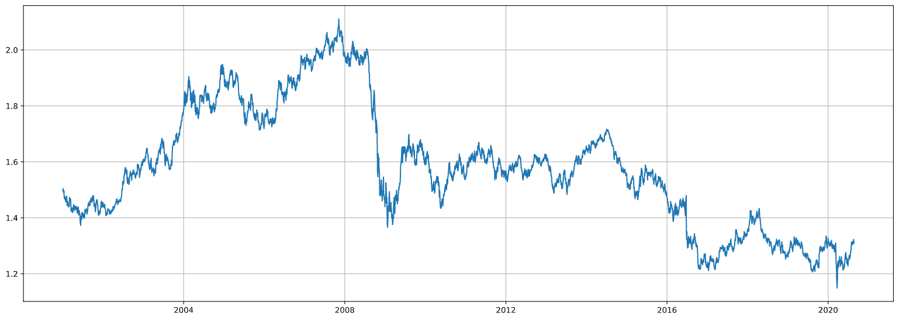
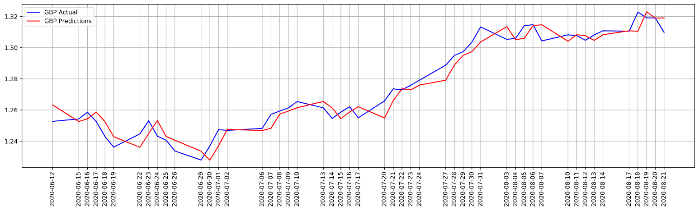
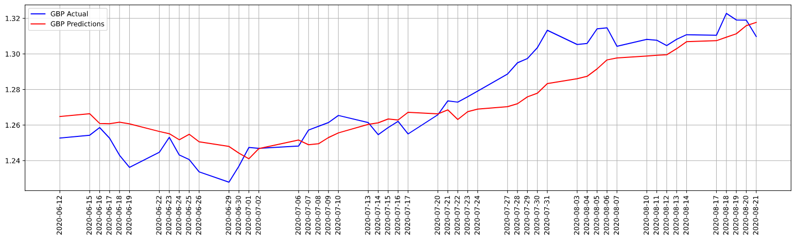
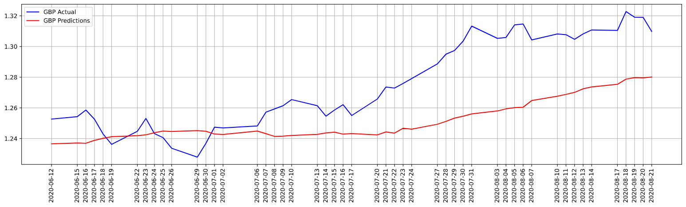
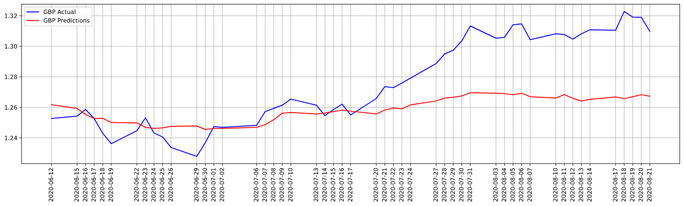
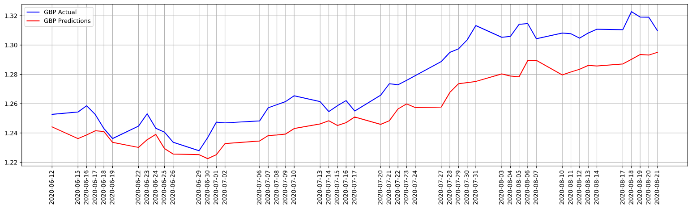

# LLM-based Exchange Rate Forecasting
How can generative AI be used for exchange rate forecasting based on historical GDP, inflation, exchange rates, and other socioeconomic factors? In finance, an exchange rate is a measure between two currencies. At this rate, one currency is exchanged for another, i.e., exchange rates are determined in the foreign exchange market, which is open to buyers and sellers, and where currency trading is continuous. It is one of the major role players in economic decisions due to its importance and effect on all sorts of financial activities. Thus, exchange rate forecasting can have a substantial role in financial decision-making. 

## Datasets
In terms of modelling forecast methods, it is essential to understand the features of exchange rates to develop decent models. First and foremost, exchange rates are sequenced data. The transactions are executed sequentially w.r.t with a timestamp, yielding a time series. Besides their sequenced nature, their other notable feature is that they are nonlinear and nonstationary, meaning they are nondirectional and ever-changing without presenting any regularity. The below graph shows that the rate fluctuates between 1.2 and 2.2, showing significant dependencies on the period. For example, Sterling can buy from 1.2$ to 2.2$: 

It is quite understandable, why these periods are so much volatile. The first one is around 2008 - the time of the sub-mortgage financial crisis and the second one is in 2016, 24 June - the day after the BREXIT referendum. 

I have chosen the GBP/USD (British Sterling / US Dollar) rate to represent a financial time series for this project. I started with the primary data: GBP/USD exchange rate. Initially, I thought of collecting the daily exchange rate data from “https://www.investing.com/”. This source provides **Date, Price, Open, Height, Low, Volume and Change(%)**. I collected a new dataset from FED, including the other **22 exchange rate parities** (which I used for the multivariate analysis models) along with the **GBP/USD parity**.

    - Forex (daily -  AUD, EUR, NZD, GBP, BRL, CAD, CNY, DKK, HKD, INR, JPY, MYR, MXN, NOK, ZAR, SGD, KRW, LKR, SEK, CHF, TWD, THB, VEB.), from https://www.federalreserve.gov/, from 2000-01-03 to 2020-08-21.

My second data source was the Federal Reserve Bank of St. Louis. I have collected **interest rates** and **normalized GDP** data (both for the US and UK, data downloaded separately) from here. 
    
    - Normalized GDP (monthly), from https://fred.stlouisfed.org/ from 2000-01-01 to 2024-04-13.     
    - Libor Rates (daily), from https://fred.stlouisfed.org/, from 2001-01-02 to 2020-09-18.

Lastly, I acquired current account to GDP data from the OECD’s website and current account to GDP (quarterly), from https://stats.oecd.org/, from Q1-2000 to Q1-2020. Eventually, I had 29 different data (28 of them to be predictor variables) and 4920 observations for each of them. I saved my pre-processed data to a new `CSV` file: **"Merged.csv"**

  - Foreign Exchange Rates
  - GDP
  - Current Account to GDP
  - Libor Rates (Interest Rates for GBP and USD)

## Current methodological approaches 
We use the Autoregressive Integrated Moving Average (ARIMA) as the baseline, along with 4 different **DL** architectures: MLP Univariate, CNN Univariate, MLP Multivariate, and CNN Multivariate are trained as its counterparts.  

### Baseline: ARIMA
To train the base econometric ARIMA model, we read the data and extracted the GBP series for univariate analysis. For the test set, I separated the last 50 observations of the data. We evaluated the model w.r.t RMSE. I observed a Test RMSE of 0.00643: the lower the RMSE, the better the prediction is. Further, the prediction vs actual comparison graph looks good:

The residual distribution is quite close to a normal distribution, confirming the ARIMA process was useful. 

### MLP Univariate
We model Multi-Layer Perceptron for UNIVARIATE analysis in a univariate analysis setting, e.g., we use yesterday’s data to predict today and today’s data to predict tomorrow's and so on. This means, we used the same data shifted … a lagged value of itself. We can use data that is 2 or 3 or more days earlier. This is a level that we decide for the lag value. I predicted 50 days of data, meaning a lag value of 50 days is used: 

I observed a Test RMSE of 0.01295, which is OKish, yet the evaluation metric is not as good as the ARIMA process.

### CNN Univariate
The second DL architecture is CNN in a univariate setting. When evaluating the model on the test set, following similar data preprocessing, I observed an RMSE of 0.03028. The score is 2,5 times worse than the MLP_U model.

### MLP Multivariate
For the multivariate analysis using MLP architecture, we lowered the lagged values to 5 from 50 compared to the previous models. Yet there are 28 more variables in the equation. 22 of them being other exchange rates and the rest are main macroeconomic indicators for both countries: the US and the UK. The test score for MLP_M seems a tad bit better than the CNN_U model: 0.0273: 

### CNN Multivariate
Time-series being a sequenced data provides a good opportunity to test CNN architectures abilities -- especially for multivariate analysis, yielding an RMSE metric of 0.02076, making it better compared to its univariate counterpart.  

## Conclusion
Key findings suggest that one of the **DL** architectures was good enough to outperform the ARIMA process: 

    - ARIMA baseline model: 0.00643
    - The Univariate MLP: 0.01295 
    - The CNN multivariate: 0.02076 
    - The MLP multivariate: 0.02739
    - The CNN univariate: 0.03028. 

### Future works
The ARIMA process is a linear regressor, thus the results of the process would be the same even if we repeat it, meaning it would show quite stable results, unlike its DL counterparts. The main reasons include random factors and stochasticity in their learning process. Therefore, I'd like to have other data sources, followed by leveraging the power of generative AI, particularly with Large Lange Models (LLMs). Nevertheless, different modalities of information exert distinctive impacts on exchange rates. Therefore, we want to employ a multimodal fusion-based long short-term memory (MF-LSTM) approach to forecasting the targeted exchange rates. For this, we model both market indicators and social media sentiments separately, followed by fusing them: 

#### Sentiment analysis 
We will employ transformer LLMs such as bidirectional encoder representations from transformers (BERT) to extract the daily sentiments in the Forex market from both countries’ social media platforms. More than a million pieces of microblogs are processed to create sentiment series.

#### Deep multimodal fusion (MF) 
Two LSTM models are deployed in the first layer to learn from the influencing factors within market indicators and social media sentiments separately. In the second layer, to represent the couplings of each modality, a shared representation layer is applied to fuse the two abstract features acquired from the first layer. Finally, a fully connected layer is fed by the coupled features learned from the previous layer to perform the exchange rate forecasting task.
